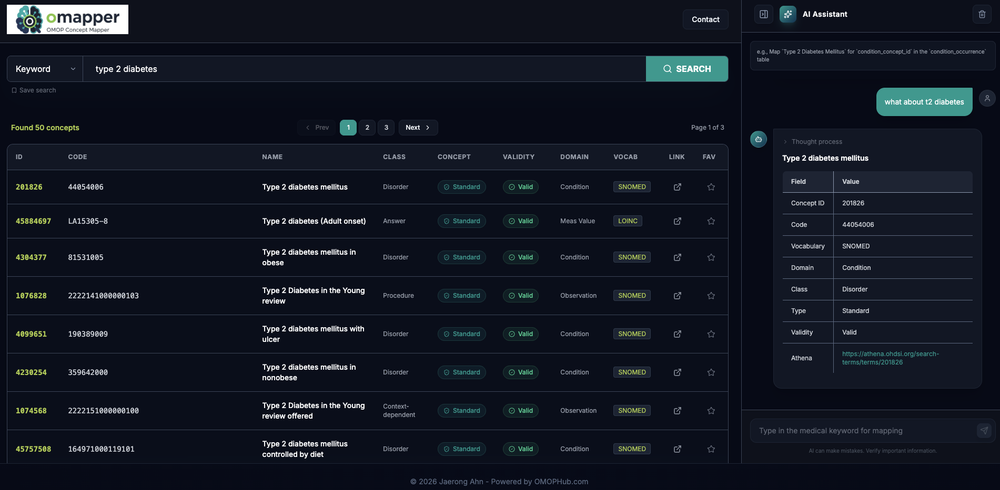

# OMOP MCP Server


[](https://arxiv.org/abs/2509.03828)

Model Context Protocol (MCP) server for mapping clinical terminology to Observational Medical Outcomes Partnership (OMOP) concepts using Large Language Models (LLMs). The vocabulary API is supported by **OMOP HUB**, and you can obtain an API key from [omophub.com](https://omophub.com).

# Demo Website ([omapper](https://omapper.org))



## Overview

This server provides an agentic framework to standardize medical terms into the OMOP Common Data Model (CDM). It uses the OMOPHub API for vocabulary searching, concept suggestion, and terminology mapping.

### Installation

Before configuring the MCP server, ensure you have:

1. **uv** installed on your system
   - Install from: https://docs.astral.sh/uv/getting-started/installation/
2. Clone the repository

   ```bash
   git clone https://github.com/OHNLP/omop_mcp.git
   cd omop_mcp
   ```

3. Set up environment variables

   Copy `.env.template` to `.env` and fill in your API credentials. You will need both an LLM provider key and an **[OMOPHUB_API_KEY](https://omophub.com)** (for vocabulary lookups).

   ```bash
   cp .env.template .env
   ```

### Configuration for Claude Desktop

Add the following configuration to your `claude_desktop_config.json` file:

**Location:**

- MacOS: `~/Library/Application\ Support/Claude/claude_desktop_config.json`
- Windows: `%APPDATA%/Claude/claude_desktop_config.json`

**Configuration:**

Replace `<path-to-local-repo>` with the actual path to your cloned repository.

```json
{
  "mcpServers": {
    "omop_mcp": {
      "command": "uv",
      "args": ["--directory", "<path-to-local-repo>", "run", "omop_mcp"]
    }
  }
}
```

## Features

The OMOP MCP server provides tools and resources for:

- **Mapping clinical terminology**: Intelligent mapping of free-text terms to standardized OMOP concepts.
- **Vocabulary Search**: Direct access to OMOP vocabulary via `find_omop_concept`.
- **Batch Processing**: Tool for mapping multiple concepts from a CSV file.
- **Preferred Vocabularies**: Automatic domain-specific vocabulary prioritization (e.g., LOINC for measurements, SNOMED for conditions).
- **Live Documentation**: Resource access to live OMOP CDM documentation.

## Usage Example

The agent is most effective when you provide context such as the OMOP table or field name.

**Prompt:**

```
Map `Temperature Temporal Scanner - RR` for `measurement_concept_id` in the `measurement` table.
```

**Response Example:**

```text
CONCEPT_ID: 46235152
CODE: 75539-7
NAME: Body temperature - Temporal artery
CLASS: Clinical Observation
CONCEPT: Standard
VALIDITY: Valid
DOMAIN: Measurement
VOCAB: LOINC
REASON: This LOINC concept specifically represents body temperature measured at the temporal artery.
URL: https://athena.ohdsi.org/search-terms/terms/46235152
```

## Contributing

See [CONTRIBUTING.md](CONTRIBUTION.md) for guidelines to contribute to the project.

## Citation Policy

If you use this software, please cite the pre-print at arXiv (cs.AI) below:

[An Agentic Model Context Protocol Framework for Medical Concept Standardization](https://arxiv.org/abs/2509.03828)

## License

This project is licensed under the Apache License 2.0. See [LICENSE](LICENSE) file for details.

**Contact:** jaerongahn@gmail.com
